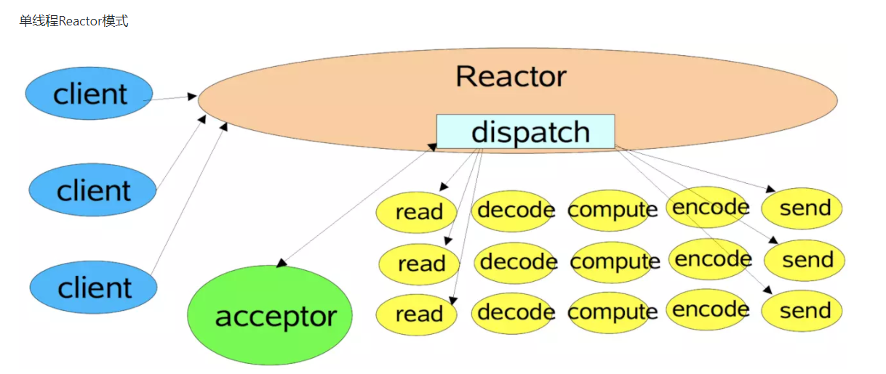
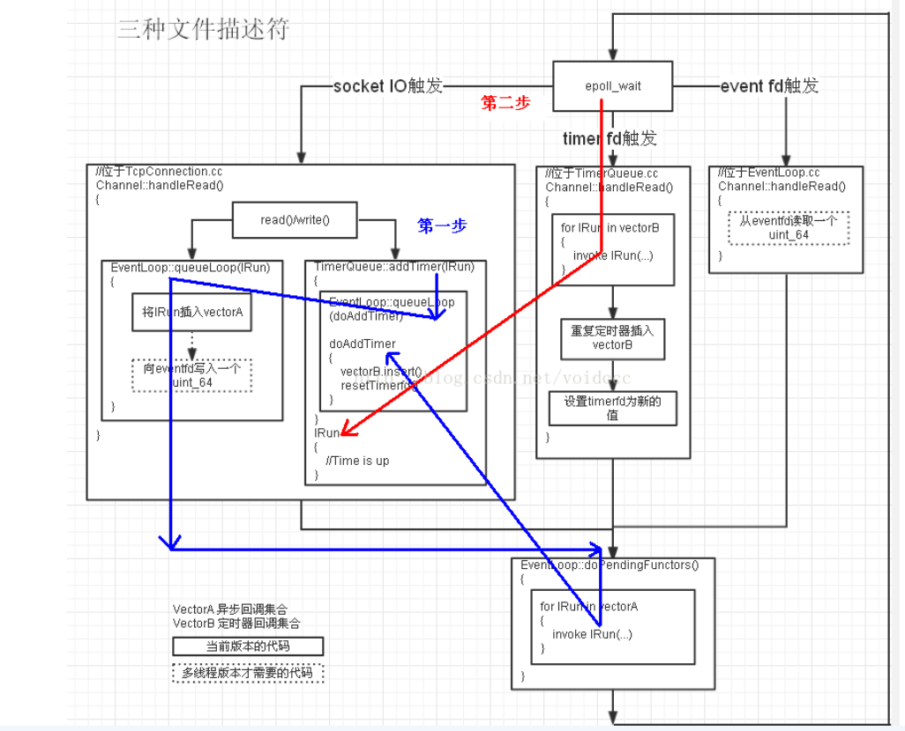

### Reactor模式

具体细节可以参考paper： https://arxiv.org/abs/1704.04651 

对应的paper是proactor的 https://www.dre.vanderbilt.edu/~schmidt/PDF/proactor.pdf

单线程的Reactor

多线程的Reactor，一个主IO

### 教程1

https://github.com/voidccc/mini-muduo 

参考这个教程可以写一个初步的muduo(通过切换不同的tag从0开始)，作者的blog有更详细的每个version做了什么改进。

缺点在于是32位系统下编译的，有一些bug和内存泄露的情况，在Timer version添加前都能正常使用，线程的模块也能正常使用。

我自己的学习顺序。

1. write a simple epoll server	

2. Add TcpServer / Channel. Channel是对fd的封装
3. Add Acceptor/ TcpConnection
4. Add EventLoop 
5. Add EchoServer(用户使用类)
6. Add Buffer and WriteComplete
7. Add Timer (单线程的Reactor成型)
8. Add multi-thread related code (单IO线程 + theadpool工作线程)

大概的架构

