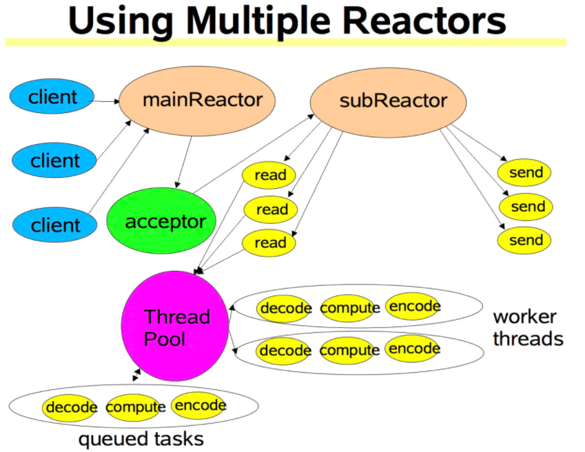

### Reactor模式

具体细节可以参考paper： https://arxiv.org/abs/1704.04651 

对应的paper是proactor的 https://www.dre.vanderbilt.edu/~schmidt/PDF/proactor.pdf

单线程的Reactor

多线程的Reactor，一个主IO

1. write a simple epoll server	
2. Add TcpServer / Channel. Channel是对fd的封装
3. Add Acceptor/ TcpConnection
4. Add EventLoop 
5. Add EchoServer(用户使用类)
6. Add Buffer and WriteComplete
7. Add Timer (单线程的Reactor成型)
8. Add multi-thread related code (单IO线程 + theadpool工作线程)
9. One loop per thread

大概的架构

